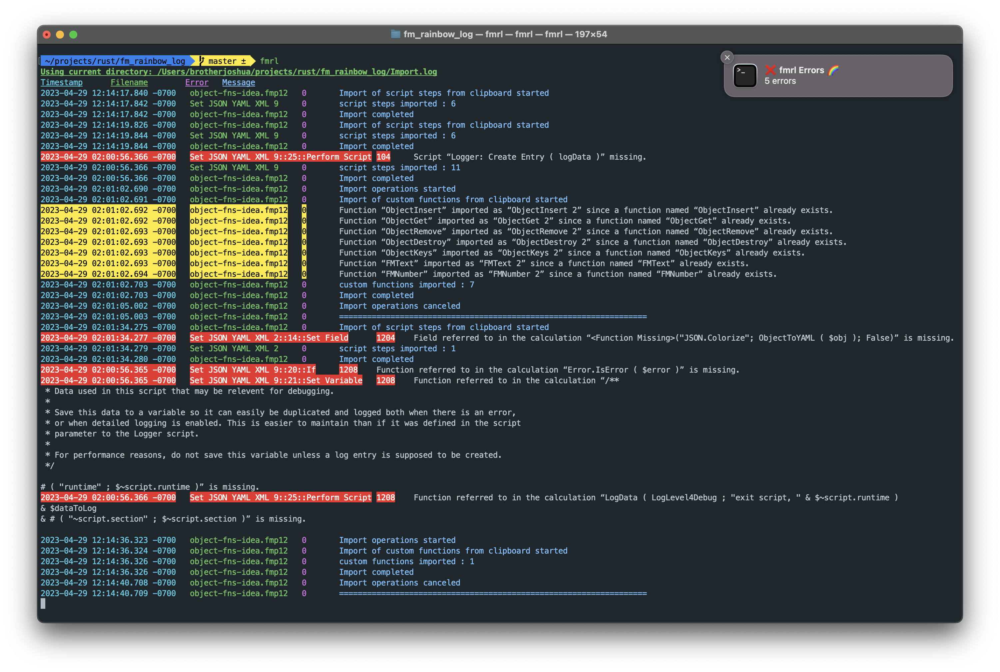

# FM Rainbow Log (fmrl)

`fmrl` (pronounced like Earl with a "fmuh") is a cross-platform command line tool to:

- 🥸 watch FileMaker Import.log files for changes
- 🦄 colorize the output
- 🚨 and highlight errors and warnings.

It displays real-time updates for both custom Import.log paths as well as the default (Documents) location when working with hosted fmp12 files.



## Motivation

FileMaker's Import.log file is helpful when importing/copying between files, but it's difficult to parse visually. Errors and warnings get buried, and columns don't align. Plus, the default macOS log viewer, Console.app wraps lines unnecessarily 🤨.

Furthermore, FileMaker calcs don't play nice with other CLI utilities like `tail` because they sometime use non-standard `\r` line endings. `fmrl` appends linefeeds as needed so messages aren't truncated when printing in the terminal.

## Installation

1. Copy the `fmrl` binary (see below) to a directory in your PATH. For example, `/usr/local/bin` on macOS.
    - To see the folders in your PATH, run this in your terminal: `echo $PATH | sed -E 's/:/\n/g'`
2. Restart your terminal and type `fmrl --help`.

### Pre-compiled binaries

Binaries will be available soon.

### Build from source

If you like 🦀 Rust, and have cargo/rustup installed, then simply clone this repo, cd to the directory, and run `cargo build --release`. The fresh-built binary will be at `target/release/fmrl`.

## Usage

watch Import.log in current directory:

```bash
fmrl
```

watch Import.log in the Documents directory for hosted files:

```bash
fmrl --docs-dir
# or short version:
# fmrl -d
```

watch in Documents directory for only errors and warnings:

```bash
fmrl --docs-dir --errors-only --warnings-only
# or short version:
# fmrl -d -e -w
```

show help (it's helpful)

```bash
fmrl --help
```

don't watch for changes, just print the log once:

```bash
fmrl --no-watch
```

## Notes

- For now `fmrl` only supports ANSI colors. Later I'd like to add customizable rgb support for terminals which support it.
  - Meanwhile, most terminals let you customize the ANSI colors, so you can already change the colors to your liking!
- On Windows I've only tested PowerShell. There are certain cases where the color escape sequences don't display properly, and show garbled text. I'm not sure how to handle every edge case (please submit suggestions/pull requests if you do).
- This is a WORK IN PROGRESS. Everything about it is subject to change, including the name and usage instructions.
- The program panics if the Import.log file doesn't exist, this is intentional.
